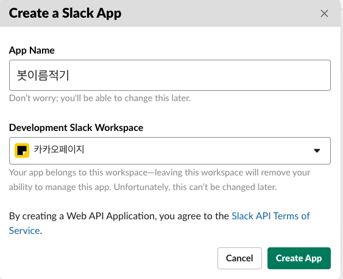
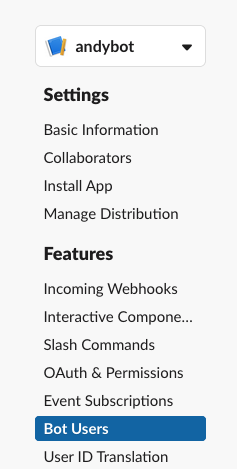
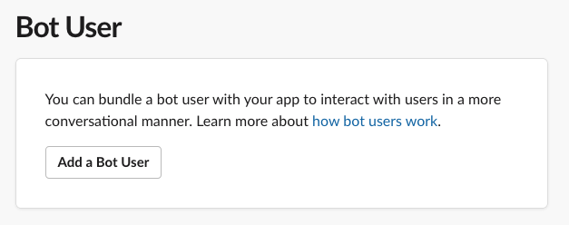
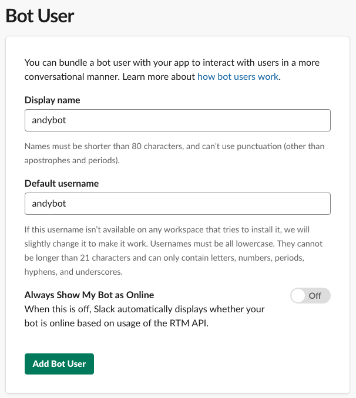
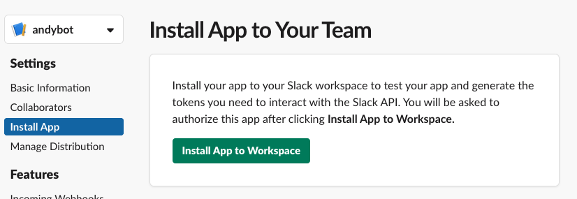
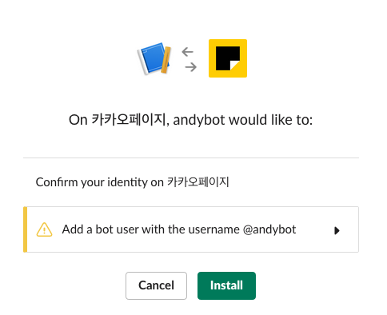
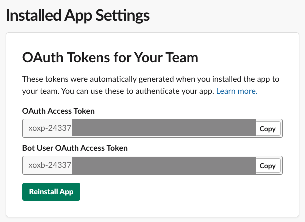
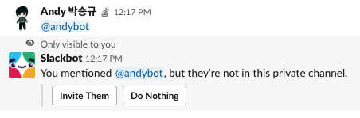

# 슬랙 봇 추가하기

아래 링크에 접속!

https://api.slack.com/apps?new_app=1

- 이름 적고, Create App 클릭

- Bot Users 클릭

- Bot User 클릭

- 이름 적어주기 - Add Bot User 클릭

### Settings의 Install App 으로 이동

- Settings 의 `Install App` 으로 이동
- `Install App to Workspace` 클릭

### Install

`Install` 클릭

### 토큰 보관하기

- 토큰을 복사하는 화면이 나오는데 유출되지 않게 잘 보관하세요~

### 채널에 추가해주기

- 채널에서 봇을 불러줍니다.
- `Invite Them` 을 클릭!

